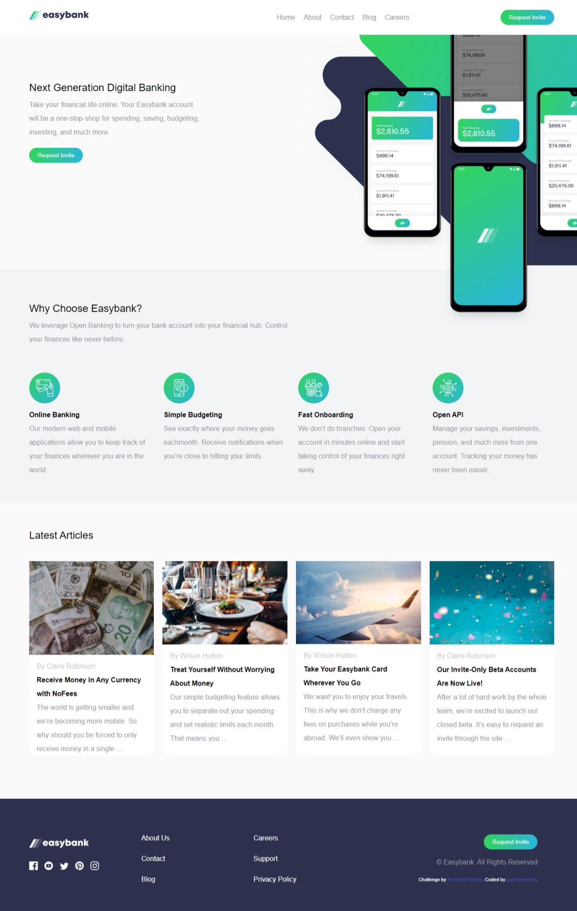

# Frontend Mentor - Easybank landing page solution

This is a solution to the [Easybank landing page challenge on Frontend Mentor](https://www.frontendmentor.io/challenges/easybank-landing-page-WaUhkoDN). Frontend Mentor challenges help you improve your coding skills by building realistic projects. 

## Table of contents

- [Frontend Mentor - Easybank landing page solution](#frontend-mentor---easybank-landing-page-solution)
  - [Table of contents](#table-of-contents)
  - [Overview](#overview)
    - [The challenge](#the-challenge)
    - [Screenshot](#screenshot)
    - [Links](#links)
  - [My process](#my-process)
    - [Built with](#built-with)
    - [What I learned](#what-i-learned)
    - [Continued development](#continued-development)
    - [Useful resources](#useful-resources)
  - [Author](#author)
  - [Acknowledgments](#acknowledgments)

## Overview

### The challenge

- challenges with javascript
- Some challenges with CSS 

### Screenshot

<<<<<<< HEAD:README.md
=======

>>>>>>> da460c2c4d117fdfa0f48e7f028f5b82af1b4995:easybank-landing-page-master/README.md

### Links

- Solution URL: [Add solution URL here](https://your-solution-url.com)
- Live Site URL: [Add live site URL here](https://your-live-site-url.com)

## My process

### Built with

- Semantic HTML5 markup
- CSS custom properties
- Flexbox
- CSS Grid
- Mobile-first workflow
- JavaScript

### What I learned

I learned so many things working on this project, trying different ways to get the work done.

### Continued development

i will like to keep learning more on CSS and JavaScript. I'm still lagging behind when it comes to JavaScript.

### Useful resources

- [W3school](https://www.W3 school.com) - This helped me with HTML and CSS. I really liked this pattern and will use it going forward.

## Author

- Website - [Gabriel Rachael](https://www.your-site.com)
- Frontend Mentor - [@Rachy112](https://www.frontendmentor.io/profile/Rachy112)
- Twitter - [@rachyworld](https://www.twitter.com/rachyworld)

## Acknowledgments
Thanks to cristopheraydan who put me through when i was facing challenges with my project.

